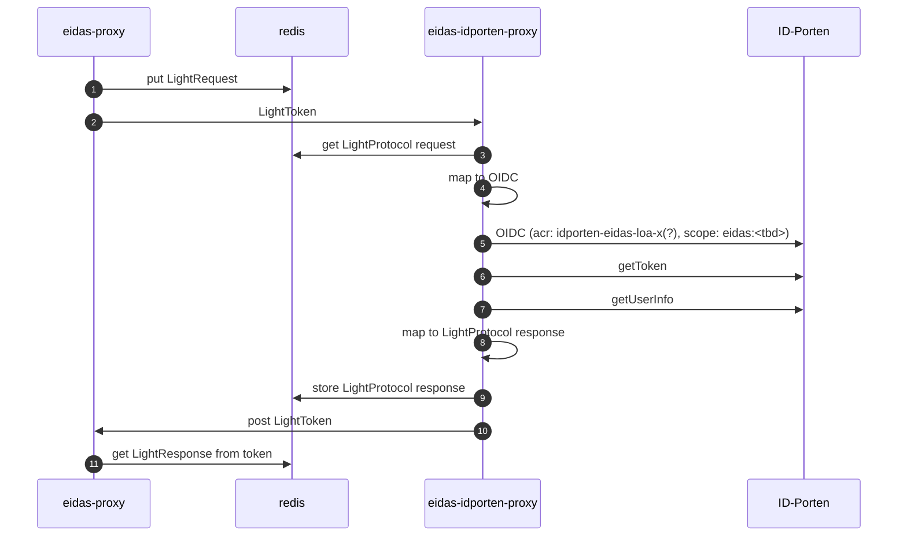

# eidas-idporten-proxy

Eidas-idporten-proxy as specific proxy for service for Norway from ID-porten.
Cache for LightProtocol requests and responses. Must match names that the eidas-proxy uses.

## Configuration

Eidas-idporten-proxy is configured with the following environment variables:
eidas.acr.supported-acr-values - Eidas ACR values supported by the eIDAS proxy. the lowes acr level must come first and
in subsequent order
eidas.acr.acr-value-map - maps ipdorten acr level to eidas acr levels.

NB! The client_id for the proxy must be added in all the environments as a trusted-onbehalfof-clients of for
client-sync.

## Sequence diagrams

### Norwegian citizen

