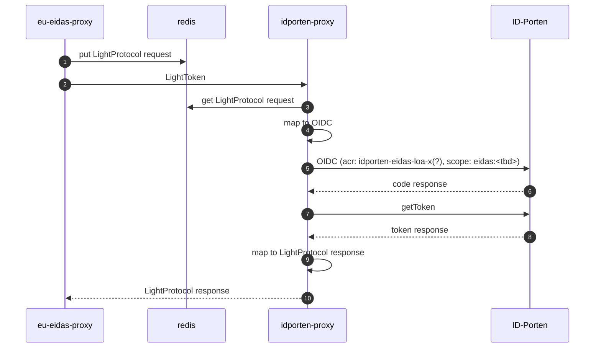

# eidas-idporten-proxy

Idporten-proxy as specific proxy for service for Norway from ID-porten.
Cache for LightProtocol requests and responses. Must match names that the eu-eidas-proxy uses.

## Configuration

Idporten-proxy is configured with the following environment variables:
eidas.acr.supported-acr-values - Eidas ACR values supported by the eIDAS proxy. the lowes acr level must come first and
in subsequent order
eidas.acr.acr-value-map - maps ipdorten acr level to eidas acr levels.

## Sequence diagrams

### Norwegian citizen

